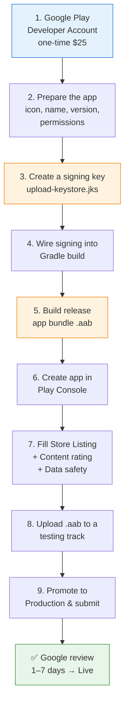
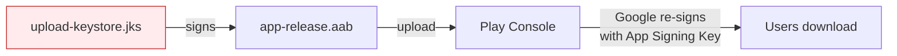
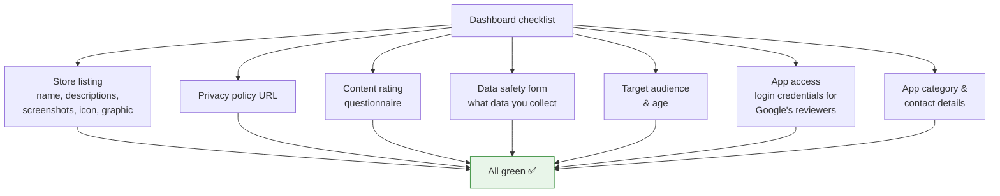
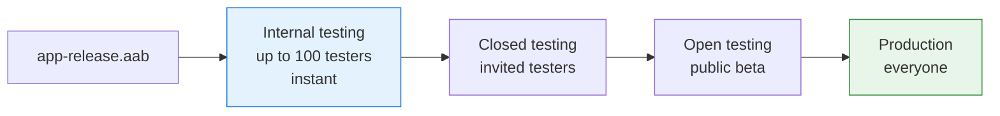
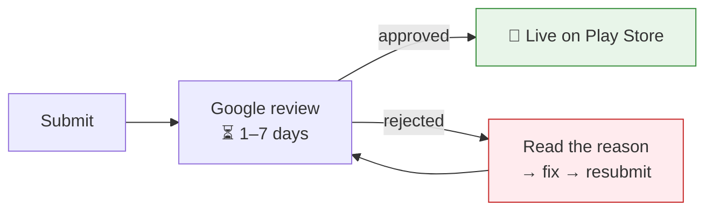
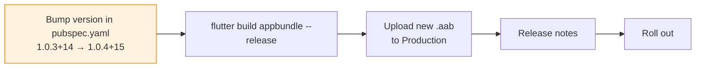

# 📱 Publishing EktaHR to the Google Play Store — Step-by-Step Guide

> **App:** EktaHR (`hrms`) — *Employee Attendance & HR Management System*
> **Framework:** Flutter
> **Current version:** `1.0.3+14`  (versionName `1.0.3`, versionCode `14`)
>
> This is a reference guide. Nothing here runs automatically — follow the steps when you're ready to publish.

---

## 🗺️ The Big Picture



---

## ✅ Step 0 — What you need before starting

| Requirement | Detail |
|---|---|
| 💳 **Google Play Developer account** | One-time **$25** fee. Sign up at [play.google.com/console](https://play.google.com/console). Use a Google account you control long-term. |
| 🆔 **Identity verification** | Google now requires ID/address verification for new accounts. Allow a few days. |
| 🎨 **App icon** | 512×512 PNG (you already have `ic_launcher.png`). |
| 🖼️ **Screenshots** | At least **2** phone screenshots (more recommended). |
| 🏞️ **Feature graphic** | 1024×500 PNG/JPG (shown at top of your store page). |
| 📝 **Privacy Policy URL** | **Mandatory** — your app handles attendance/employee data. A public webpage link. |
| 🔐 **A signing keystore** | Created in Step 3. **Back it up — losing it means you can never update the app.** |

---

## 🛠️ Step 1 — Prepare the app for release

### 1a. Confirm your application ID
Open [android/app/build.gradle.kts](android/app/build.gradle.kts) and check `applicationId`. This is your app's **permanent, unique identity** on Play (e.g. `com.ektahr.hrms`). It can **never** be changed once published.

```kotlin
defaultConfig {
    applicationId = "com.ektahr.hrms"   // ← must be unique & final
    minSdk = flutter.minSdkVersion
    targetSdk = flutter.targetSdkVersion // keep this on a recent API level
    versionCode = flutter.versionCode
    versionName = flutter.versionName
}
```

### 1b. Set the version
In [pubspec.yaml](pubspec.yaml):

```yaml
version: 1.0.3+14
#         │     └── versionCode → must INCREASE for every Play upload
#         └──────── versionName → the human-readable version shown to users
```

> ⚠️ Every new upload to Play **must** have a higher `versionCode` (the number after `+`). Next upload → `1.0.4+15`, etc.

### 1c. Review permissions
Open [android/app/src/main/AndroidManifest.xml](android/app/src/main/AndroidManifest.xml). Remove any permission you don't actually use — Google asks you to justify each one (especially **location**, **camera**, **storage**). An attendance app typically needs location/camera, which is fine but must be declared in **Data Safety**.

---

## 🔐 Step 2 — Create your upload keystore

Run this **once** (Windows PowerShell). It produces a `.jks` file that signs every release.

```powershell
keytool -genkey -v `
  -keystore $env:USERPROFILE\upload-keystore.jks `
  -storetype JKS `
  -keyalg RSA -keysize 2048 -validity 10000 `
  -alias upload
```

It will prompt for a password and your name/org. **Remember the password.**



> 🔒 **CRITICAL:** Store `upload-keystore.jks` and its passwords somewhere safe and backed up (password manager + cloud backup). If you lose it, you **cannot** publish updates to this app — ever.

---

## ⚙️ Step 3 — Wire the key into Gradle

### 3a. Create `android/key.properties` (do **NOT** commit to git)

```properties
storePassword=YOUR_STORE_PASSWORD
keyPassword=YOUR_KEY_PASSWORD
keyAlias=upload
storeFile=C:/Users/YOUR_NAME/upload-keystore.jks
```

Add it to [android/.gitignore](android/.gitignore):
```
key.properties
*.jks
```

### 3b. Reference it in [android/app/build.gradle.kts](android/app/build.gradle.kts)

```kotlin
import java.util.Properties
import java.io.FileInputStream

val keystoreProperties = Properties()
val keystorePropertiesFile = rootProject.file("key.properties")
if (keystorePropertiesFile.exists()) {
    keystoreProperties.load(FileInputStream(keystorePropertiesFile))
}

android {
    signingConfigs {
        create("release") {
            keyAlias = keystoreProperties["keyAlias"] as String
            keyPassword = keystoreProperties["keyPassword"] as String
            storeFile = file(keystoreProperties["storeFile"] as String)
            storePassword = keystoreProperties["storePassword"] as String
        }
    }
    buildTypes {
        release {
            signingConfig = signingConfigs.getByName("release")
            isMinifyEnabled = true
            isShrinkResources = true
        }
    }
}
```

---

## 📦 Step 4 — Build the release App Bundle (`.aab`)

Play Store requires an **`.aab`** (Android App Bundle), not an APK.

```powershell
flutter clean
flutter pub get
flutter build appbundle --release
```

Output file:
```
build/app/outputs/bundle/release/app-release.aab
```

> 💡 To test the release build on a real phone first, build an APK instead:
> `flutter build apk --release` → `build/app/outputs/flutter-apk/app-release.apk`

---

## 🏪 Step 5 — Create the app in Play Console

Go to [play.google.com/console](https://play.google.com/console) → **Create app**.

```
┌─────────────────────────────────────────────┐
│  Create app                                  │
├─────────────────────────────────────────────┤
│  App name:        EktaHR                      │
│  Default language: English (United States)    │
│  App or game:     ● App   ○ Game              │
│  Free or paid:    ● Free  ○ Paid              │
│                                               │
│  ☑ Developer Program Policies                 │
│  ☑ US export laws                             │
│                       [ Create app ]          │
└─────────────────────────────────────────────┘
```

---

## 📝 Step 6 — Complete the required declarations

The Play Console **Dashboard** shows a checklist. You must finish all of these before publishing:



### Key forms explained

| Section | What to provide |
|---|---|
| **Store listing** | Short description (80 chars), full description (4000 chars), app icon (512×512), feature graphic (1024×500), ≥2 phone screenshots. |
| **App access** | Your app needs a login. **Provide a demo username/password** so Google's reviewers can log in — otherwise they'll reject it. |
| **Data safety** | Declare you collect employee data (name, location, attendance). Be honest — mismatches cause rejection. |
| **Content rating** | Fill the questionnaire → likely "Everyone". |
| **Target audience** | Choose age groups (this is a workplace app → 18+ is typical). |
| **Privacy policy** | A live URL describing what data you collect and why. **Required.** |

---

## ⬆️ Step 7 — Upload the bundle to a testing track first

**Don't go straight to Production.** Use a testing track to catch issues.



**Path:** Play Console → **Testing → Internal testing → Create new release** → upload `app-release.aab` → add release notes → **Save → Review release → Start rollout**.

Add your own email as a tester, install via the opt-in link, and verify the app works.

---

## 🚀 Step 8 — Promote to Production & submit for review

When testing looks good:

```
Production  →  Create new release  →  (reuse the tested bundle)
            →  Release notes        →  "Initial release of EktaHR"
            →  Review release       →  Start rollout to Production
```



> 🕐 **First-time apps** can take longer (sometimes up to a week or more) because of the new-developer review. Updates are usually faster.

---

## 🔁 Releasing future updates (the short loop)



1. Increase **both** the version name and **versionCode** in [pubspec.yaml](pubspec.yaml).
2. `flutter build appbundle --release`.
3. Upload the new `.aab`, add release notes, roll out.

---

## ⚠️ Common rejection reasons (avoid these)

| Problem | Fix |
|---|---|
| ❌ No demo login provided | Fill **App access** with working test credentials. |
| ❌ Missing/invalid privacy policy | Host a real privacy policy page and link it. |
| ❌ Data safety form doesn't match reality | Declare every type of data you collect (location, etc.). |
| ❌ Undeclared sensitive permissions | Remove unused permissions; justify location/camera. |
| ❌ Crashes on reviewer's device | Test the **release** build on a real device first. |
| ❌ versionCode not increased | Always bump the number after `+`. |
| ❌ Targeting old Android API | Keep `targetSdk` on a current API level (Google enforces a minimum). |

---

## 📋 Pre-submission checklist

- [ ] Play Developer account created & verified ($25 paid)
- [ ] `applicationId` is final and unique
- [ ] App icon, feature graphic, ≥2 screenshots ready
- [ ] Privacy policy live at a public URL
- [ ] `upload-keystore.jks` created **and backed up safely**
- [ ] `key.properties` set up and git-ignored
- [ ] `flutter build appbundle --release` succeeds
- [ ] Release tested on a real device
- [ ] Store listing, Data safety, Content rating, App access all completed
- [ ] Demo login credentials provided to reviewers
- [ ] Bundle uploaded to Internal testing and verified
- [ ] Promoted to Production and submitted

---

### 📚 Official references
- Flutter — [Build & release an Android app](https://docs.flutter.dev/deployment/android)
- Android — [App signing](https://developer.android.com/studio/publish/app-signing)
- Play Console — [Help center](https://support.google.com/googleplay/android-developer)

---
*Guide generated for the EktaHR project. Update the `applicationId`, package name, and version examples to match your actual values.*
